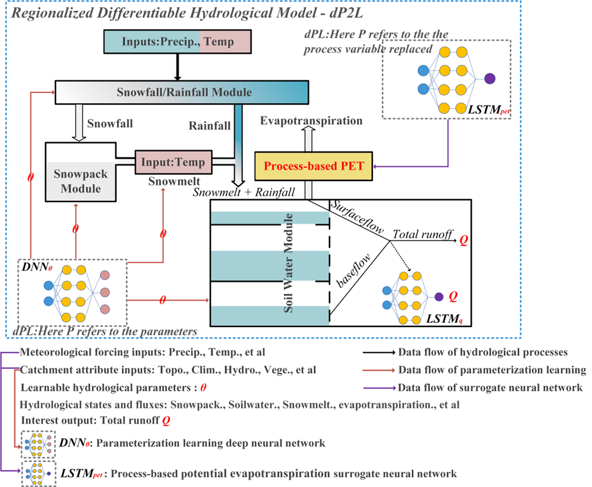
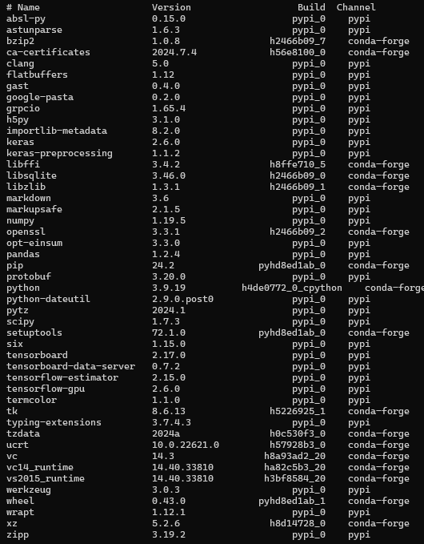
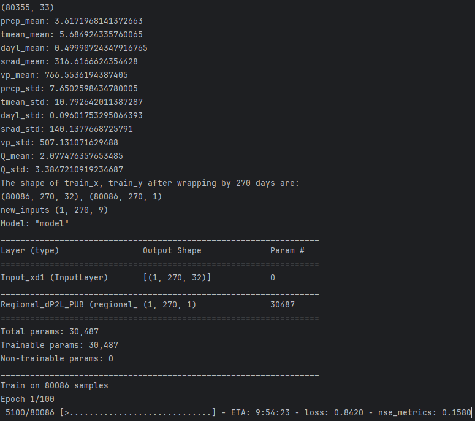

# dP2L-models-for-CAMELS-learning：
dP2L was developed by Heng Li, Chunxiao Zhang* and others from China University of Geosciences (Beijing) for rainfall-runoff learning in large sample basins. 
The related manuscript "***A Differentiability‌-based Processes and Parameters Learning Hydrologic Model for Advancing Runoff Prediction and Process Understanding***" is currently under peer review in *Journal of Hydrology*.


# Model dependency library：


# Path and file comments：
"../the project path/"：Model project root directory  
"../the project path/basin_list.txt"：List text of basin ids  
"../the project path/dP2L_class.py"：Model class file  
"../the project path/dP2L1_Train_Demo.py"：Model training file  
"../the project path/dataprocess.py"：CAMELS data preprocessing file  
"../the project path/loss.py"：Model loss function file  
  
"../the project path/CAMELS_attributes/attributedata_671.csv"：CAMELS basin attribute data (unstandardized)  
"../the project path/camels_h5/usgs_streamflow/HUC_id(e.g., 01, 02, 03, 04, 05...)/{basin_id}_streamflow_qc.txt"：CAMELS basin streamflow data  
"../the project path/camels_h5/basin_mean_forcing/daymet/HUC_id(e.g., 01, 02, 03, 04, 05...)/{basin_id}_lump_cida_forcing_leap.txt"：CAMELS basin mean_forcings

"../the project path/Models_h5/"：Model storage path  


--------------------------------------------------------------------------------------------------------------------------------------------------------------------------------------------------
# Quick Start：
The code was tested with Python 3.6. To use this code, please do:

1. Clone the repo using Conda. Note*：In the tensorflow_2.6.yml file, the last line `prefix: ..\Users\anaconda3\envs\tensorflow_2.6` specifies the installation path of the Conda environment.
   Please make sure to change this path to match the location of your own Conda installation. This line is automatically generated when exporting environments, and keeping an incorrect path may cause issues during environment creation:

   ```shell
   conda env create -f tensorflow_2.6.yaml -n tensorflow_2.6
   ```

2. Please change the following working path (dP2L_Train_Demo.py) to your owns:

   ```shell
   working_path = "../the project path"
   attrs_path = "../the project path/CAMELS_attributes/attributedata_671.csv"
   save_path_models = f"../the project path/Models_h5/dP2L.h5"
   ```

3. Download CAMELS-US dataset `https://ral.ucar.edu/solutions/products/camels` or use the example data provided in this repository, and reorganize the directory as follows:

   ```
   Root Directory\dP2L\
   |   |dP2L_Train_Demo.py
   |   |dP2L_class.py
   |   |dataprocess.py
   |   |loss.py
   ```

   ```
   Root Directory\dP2L\camels_data\
   |   |standardized_CAMELS_attributes.csv
   ```
   
   ```
   Root Directory\dP2L\
   |   |basin_list.txt
   ```

   ```
   Root Directory\dP2L\camels_data\
   |---basin_mean_forcing\
   |       |---daymet\
   |         |---01\
   |         |---...	
   |         |---18	\
   |---usgs_streamflow\
             |---01\
             |---...	
             |---18\
   ```

4. Start `PyCharm` or `Jupyter Notebook`, and run the `dP2L_Train_Demo.py` locally.

5. A simple example for training 11 basins
    [Note*：After setting up model dependencies, downloading the CAMELS dataset, preparing the standardized attribute CSV file of the CAMELS watershed, and setting up the code path and data path as guided in step 3, you can run the code as follows]<br>

  First, open the dP2L_Train_Demo.py, change the paths to your PC
   ```python
working_path = "Root Directory\\dP2L"
attrs_path = "Root Directory\\dP2L\\camels_data\\standardized_CAMELS_attributes.csv"
save_path_models = f"Root Directory\dP2L\\dP2L.h5"
   ```

  Second, add 11 basin_ids to the basin_id list in dP2L_Train_Demo.py
   ```python
basin_id = [
'1022500',
'1031500',
'1047000',
'1052500',
'1054200',
'1055000',
'1057000',
'1073000',
'1078000',
'1123000',
'1134500']
   ```

  Third, run the dP2L_Train_Demo.py. The successful operation interface is as follows：
  


## Tips on the regional dP2L model
(For other questions, please contact lh_mygis@163.com. We are happy to work together to further develop the dP2L model and gradually complete this model repository.)

To implement the regional dP2L model (Process learning LSTM pipeline + parameterization DNN pipeline) as developed in the study, we provide `ScaleLayer_regional_parameterization`, `LSTM_parameterization`, and `regional_dP2L` classes in the `dP2L_class.py`. Below are some details to use the classes for creating the regional dP2L model:

   ```python
class ScaleLayer_regional_parameterization(Layer):


    def __init__(self, **kwargs):
        super(ScaleLayer_regional_parameterization, self).__init__(**kwargs)

    def build(self, input_shape):
        self.t_mean = self.add_weight(name='t_mean', shape=(1,),  
                                 initializer=initializers.Constant(value=10.50360728383252),
                                 constraint=constraints.min_max_norm(min_value=0.0, max_value=10000.0, rate=0.9),
                                 trainable=False)
        self.t_std = self.add_weight(name='t_std', shape=(1,), 
                                 initializer=initializers.Constant(value=10.30964231561827),
                                 constraint=constraints.min_max_norm(min_value=0.0, max_value=10000.0, rate=0.9),
                                 trainable=False)

        self.dayl_mean = self.add_weight(name='dayl_mean', shape=(1,), 
                                 initializer=initializers.Constant(value=0.49992111027762387),
                                 constraint=constraints.min_max_norm(min_value=0.0, max_value=10000.0, rate=0.9),
                                 trainable=False)
        self.dayl_std = self.add_weight(name='dayl_std', shape=(1,), 
                                 initializer=initializers.Constant(value=0.08233807739244361),
                                 constraint=constraints.min_max_norm(min_value=0.0, max_value=10000.0, rate=0.9),
                                 trainable=False)


        super(ScaleLayer_regional_parameterization, self).build(input_shape)

    def call(self, inputs):
        met = inputs[:,:,:2]

        self.t_scaled = (met[:,:,0:1] - self.t_mean) / self.t_std
        self.dayl_scaled = (met[:,:,1:2] - self.dayl_mean) / self.dayl_std


        self.met_scaled = K.concatenate((self.t_scaled, self.dayl_scaled), axis=-1)

        attrs = inputs[:,:,2:]

        return  K.concatenate((self.met_scaled, attrs), axis=-1)

    def compute_output_shape(self, input_shape):
        return input_shape
   ```

For the `ScaleLayer_regional_parameterization` class, please note:
`self.t_mean`, `self.t_std`, `self.dayl_mean`, and `self.dayl_std` represent the mean and standard deviation of daily temperature and day length of the training basin set during the training period. When the basin set is different or the training period is different, the four parameters also need to be modified.
